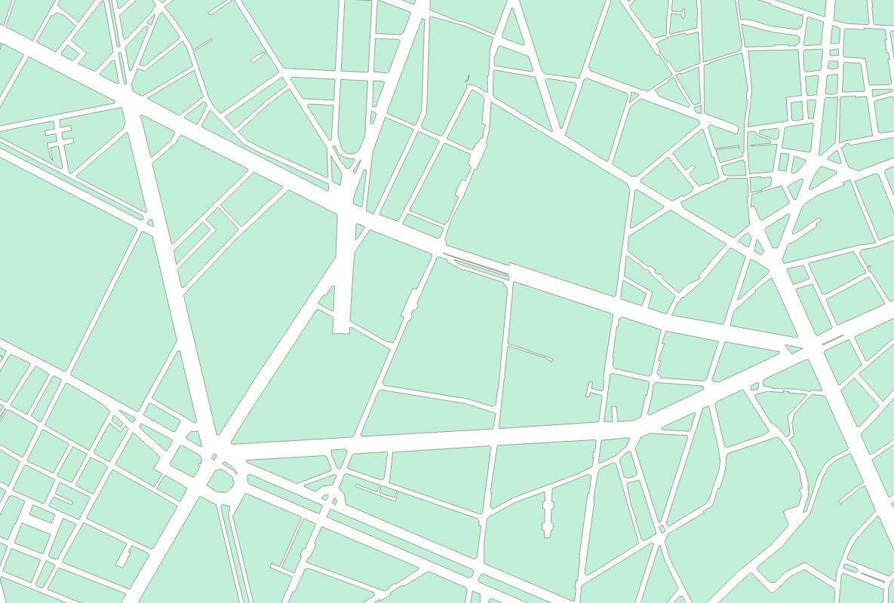
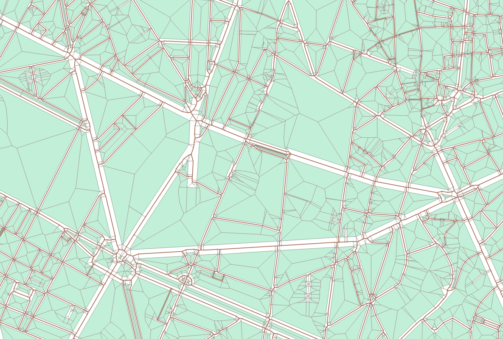

# RoadSegment
## Prerequisites

Install CGAL 6.0.1 according to [the manual](https://doc.cgal.org/latest/Manual/usage.html) (note: the simplest method is using CGAL Source Archive).

You also need to install CMake and GDAL.

## Installation
```shell
cmake -DCGAL_DIR=$HOME/CGAL-6.0.1 -DCMAKE_BUILD_TYPE=Release .
make
```

## Usage
The program has 4 parameters:
- the name of the **input** GPKG file (polygons)
- the name of the **input** layer
- the name of the **ouput** GPKG file (the layer will have the same name as the input layer)
- a boolean: export all segments if true or only road segments if false

## Examples



To export the road segments from layer *input_layer* of *input.gpkg* into *output_light.gpkg*
```shell
./sdg input.gpkg input_layer output_light.gpkg false
```

To export all segments from layer *input_layer* of *input.gpkg* into *output_full.gpkg*
```shell
./sdg input.gpkg input_layer output_full.gpkg true
```


## Notes
If the output GPKG file is not empty, the program will try to append. 
If the layer already exists, it will fail. 
You can, for instance, remove the layer by hand using:
```shell
ogrinfo -sql "DROP TABLE input_layer" output.gpkg
ogrinfo -sql "VACUUM" output.gpkg
```

The gpkg output is quite slow, especially when appending to an existing file.
Maybe we should rethink the ouput format...